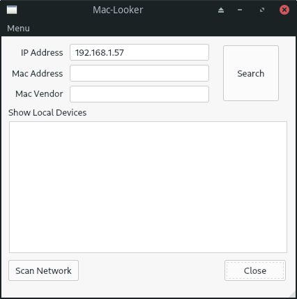
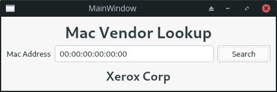

# C++ Local Network Scanner & Mac Looker

Built With;
- QT (Json Handling, QtConcurrent(async) .. )
- C++
- [Mac Vendor Database](vendor-search)
and some love.. :heart_eyes:

>> It's what it is :bowtie:

## App Screens

